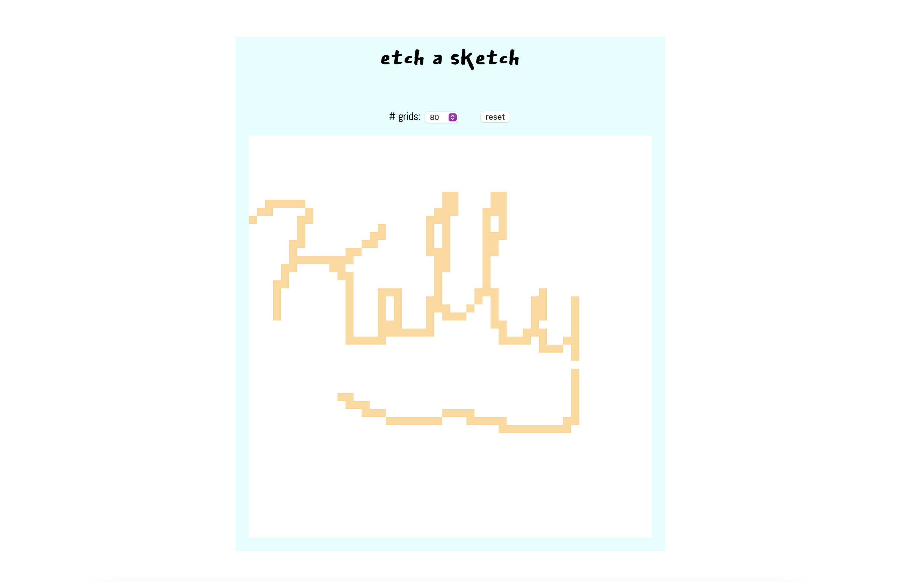

# etch-a-sketch

To practice DOM manipulation, here's another frontend project from the [Odin Project](https://www.theodinproject.com/courses/foundations/lessons/etch-a-sketch-project).

## Browser

I created the simple sketchpad for desktop users:

### Learning

This project taught me a lot about dynamically-creating elements using JS. In particular, these are my takeaways:

- Write human-readable, _DRY_ functions to make it easier on myself.
- Use `const` instead of `let` when querying for document elements.
- Developer tools are my friend, and so is `console.log()`!

## To dos

- Enable pixel darkening
- Click and drag function
- Add a palette of colours to choose from
